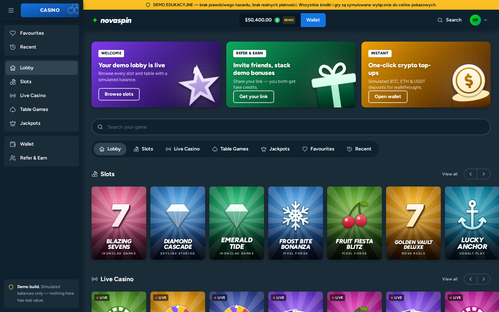

# Casino Launcher UI/API — EDUCATIONAL DEMO

> **This is not a real gambling product.** No real money, no real payment
> processors, no KYC/AML, no licensing, no game logic. It exists to
> demonstrate — for an educational/YouTube walkthrough — how quickly a
> modern "casino aggregator" style front end (login, lobby, wallet,
> deposits, referrals) can be scaffolded. **Do not deploy this publicly,
> connect it to real payments, or represent it as a licensed gambling
> service.** Anyone doing that is responsible for the legal consequences
> themselves — this repo provides none of the licensing, age-verification,
> or compliance work that real-money gambling requires in every
> jurisdiction.



## What's here

A monorepo mimicking the tech shape of typical iframe-based casino
aggregator launchers (a lobby site that loads third-party game clients in
an iframe, e.g. `?gameid=...&mode=demo&token=...`).

### `apps/web` — Vue 3 + Vite + Pinia + Tailwind CSS

Styled like a modern crypto-casino lobby: dark navy theme, collapsible
sidebar, balance + wallet button in the top bar, bottom nav on mobile.

- **Lobby** — promo banners, category tabs, scrollable game rows, provider
  filter and sorting, favourites and recently played (stored in the
  browser), a search overlay (`/` or Ctrl+K).
- **Game page** — animated launch splash, then the iframe slot left as a
  placeholder (no game clients are wired up).
- **Wallet** — fake "crypto pay" deposit modal that instantly credits the
  balance (no blockchain, no processor), history with filters and CSV
  export.
- **Refer & Earn** — personal link/code, share buttons, invited friends and
  earnings; the register page validates codes live and shows who invited
  you.
- **Notifications** — a bell that polls the wallet, so a friend signing up
  with your link pops up live; toasts for actions.
- **Settings** — username, avatar, password, streamer mode (masks every
  balance on screen — handy when recording), language.
- **Responsible play** — a daily deposit limit enforced by the API and a
  "reality check" reminder with session time and deposits.
- **Polish/English UI** — auto-detected from the browser, switchable in the
  sidebar, Settings, footer and auth screens (`apps/web/src/i18n`).
- Game cover art is generated from each title (SVG emblem + palette), so no
  third-party artwork ships with the repo.

### `apps/api` — Fastify + Prisma + SQLite

JWT auth, wallet/balance ledger with deposit limits, referral codes +
rewards, profile/password updates, and a `/games` catalog serving
placeholder metadata with a `launchPath` shaped for an iframe game client.
Login, register, password change and referral lookups are rate-limited per
IP, and the API refuses to start with the default JWT secret when
`NODE_ENV=production`. Endpoints are listed in `apps/api/README.md`.

## Running locally

One command, from a fresh clone:

```bash
npm start
```

That installs dependencies for both apps, creates `apps/api/.env`, sets up
the local SQLite database (migrate + seed 48 placeholder games), starts the
API on `http://localhost:8787` and the web app on `http://localhost:5173`,
and opens the web app in your browser. Ctrl+C stops both servers.

Re-running `npm start` later is safe and fast (it skips `.env` creation if
it already exists, and the database setup is idempotent).

A demo login is seeded automatically so you don't need to register on
camera:

- **Email:** `demo@novaspin.test`
- **Password:** `demo1234`
- Comes pre-loaded with a $50,000 fake balance, plus three seeded friends it
  "invited" (so the Refer & Earn page isn't empty) and their $5,000 demo
  referral bonuses each.
- The friends can log in too: `friend1@novaspin.test` … `friend3@novaspin.test`,
  same password.

To show the referral flow live, copy the link from **Refer & Earn** (e.g.
`http://localhost:5173/register?ref=DEMO0001`), open it in a private window
and register: the form confirms who invited you, the new account gets the
demo welcome bonus and the referrer's dashboard picks up the new friend.
Referral links are built from `WEB_ORIGIN` in `apps/api/.env`.

### Docker

```bash
docker compose up --build
```

Web on `http://localhost:8080`, API on `http://localhost:8787`, SQLite in
a named volume (`api-data`). The API container migrates and seeds on every
start. Without `JWT_SECRET` it generates a random one per start (you just
sign in again after a restart); set `JWT_SECRET` to keep sessions.

### Running the pieces separately

If you'd rather run things by hand — see `apps/api/README.md` and
`apps/web/README.md`.

## Tests

```bash
npm run typecheck   # API (incl. tests + seed) and web
npm test            # Vitest: API integration tests + web unit tests
npm run test:e2e    # Playwright end-to-end suite
```

- **API** (`apps/api/test`) — drives the Fastify app with `app.inject()`
  against a throwaway SQLite DB migrated fresh per run: auth, profile,
  password change, rate limiting, referrals, wallet limits, games.
- **Web** (`apps/web/src/**/*.test.ts`) — i18n (plurals, fallbacks, and a
  check that every key used in the code exists in both languages),
  formatting, transaction notes, game art, categories, avatars.
- **E2E** (`e2e/`) — starts its own API on :8788 with a freshly seeded DB
  and a web dev server on :5174, so it runs fine next to `npm start`.
  Covers sign-in, referral sign-up, search, favourites, deposits and
  limits, CSV export, live referral notifications, settings, reality
  check and the Polish UI.

GitHub Actions (`.github/workflows/ci.yml`) runs typecheck, unit tests and
builds, then the Playwright suite and a `docker compose build`, on pushes to
`main` and on pull requests.
